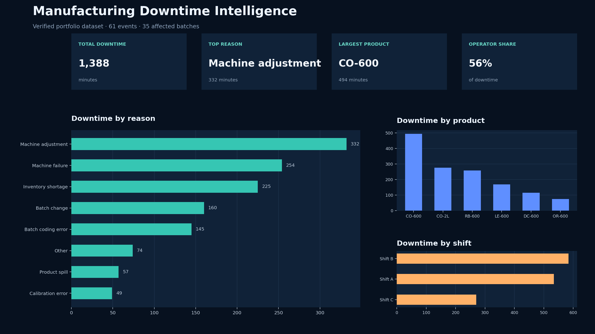
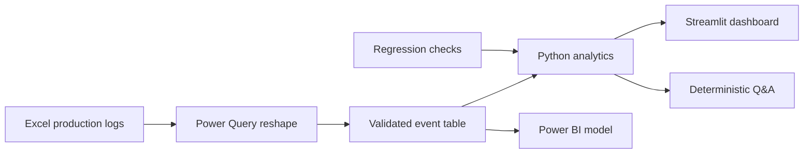

# Manufacturing Downtime Explanation Copilot



A reproducible analytics product that turns row-level production downtime into decision-ready KPIs, ranked loss drivers, interactive filters, and deterministic natural-language explanations.

## Why this project matters

Manufacturing reports often show *what* stopped a line but make it hard to identify where attention should go first. This project combines a validated analytical model with a lightweight explanation layer so supervisors can move from raw events to a defensible answer quickly.

The original workbook contained a KPI inconsistency: its dashboard identified one operator as having the most associated downtime, while recomputation from the source rows showed a different operator at 384 minutes. The public version fixes this by calculating every KPI from the included dataset and locking the expected values with tests. Operator names are anonymized before publication.

## Verified results

| Metric | Result |
|---|---:|
| Downtime analyzed | 1,388 minutes |
| Validated events | 61 |
| Affected batches | 35 |
| Leading reason | Machine adjustment — 332 minutes |
| Highest-loss product | CO-600 — 494 minutes |
| Highest-loss shift | Shift B — 584 minutes |
| Operator-attributed share | 55.9% |

## Architecture



## Design choices

- **Reproducible metrics:** charts and narrative answers share the same aggregation functions.
- **Testable architecture:** `downtime_analytics.py` contains pure logic; `app.py` owns presentation.
- **Honest explanations:** the natural-language layer performs traceable filtering and aggregation. It does not pretend to be a generative model.
- **Privacy by default:** operator identities are replaced with stable anonymous labels before data is published.
- **Failure visibility:** missing columns, invalid minutes, duplicates, and empty filters are handled explicitly.

## Project structure

```text
manufacturing-downtime-copilot/
├── app.py                       # Streamlit interface
├── downtime_analytics.py        # Validation, KPIs, filtering, Q&A
├── data/downtime_detail.csv     # Anonymized portfolio dataset
├── scripts/prepare_public_data.py
├── tests/test_analytics.py
├── requirements.txt
└── assets/downtime-dashboard.png
```

## Run locally

```bash
python -m venv .venv
python -m pip install -r requirements-dev.txt
python -m unittest discover -s tests -v
streamlit run app.py
```

## Example questions

- `What is the top downtime reason?`
- `Summarize Shift B`
- `What is the top downtime reason for CO-600?`
- `What is the operator error share?`

## Responsible interpretation

Downtime associated with an operator is not proof that the operator caused the event. The app uses the source field `Operator Error` for attributed-event analysis and explicitly labels other operator results as associations rather than causal findings.
